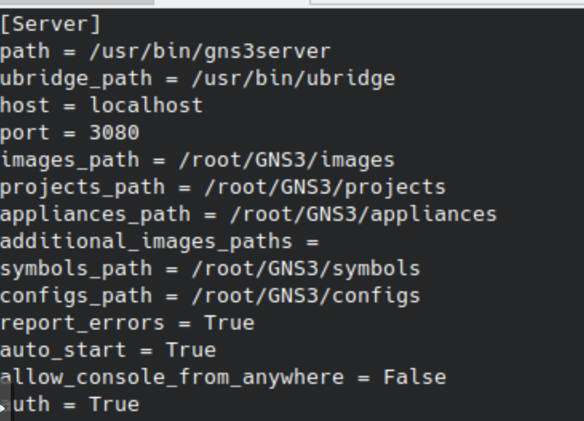

# Just trying to do anything in gns3

There were a few options to install gns3, but what I thought would be most convenient and work for me was to host the server on a VM in proxmox and use the same server to use the gui. 

Install the server and gui. 

```
sudo add-apt-repository ppa:gns3/ppa
sudo apt update
sudo apt install gns3-gui gns3-server
```
Launch the server



Downloaded mikrotik routerOS because it is free. 

Couldn't launch my device. 


Recommended changes... 


Now can launch mikrotik device. 

Attempt to get into console of device. receive errors. 

```
Error constructing proxy for org-gnome.Terminal:/org/gnome/Terminal/Factory0: Failed to execute child process "dbus-launch" (No such file or directory)
```

download dbus-x11

```
apt install dbux-x11
```

Ah, finally able to console in. 


Start designing a basic network
 had to start launching gns3 with root user.
