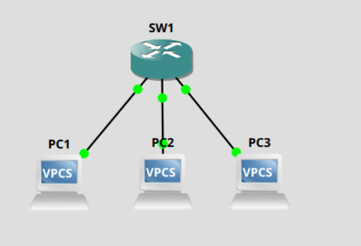

# Just trying to do anything in gns3

There were a few options to install gns3, but what I thought would be most convenient and work for me was to host the server on a VM in proxmox and use the same server as the gui. 

Install the server and gui. 

```
sudo add-apt-repository ppa:gns3/ppa
sudo apt update
sudo apt install gns3-gui gns3-server
```
Launch the server


Downloaded mikrotik routerOS because it is free. 

Couldn't launch my device. 


Recommended changes... 


Now can launch mikrotik device 

Attempt to get into console of device. receive errors. 

```
Error constructing proxy for org-gnome.Terminal:/org/gnome/Terminal/Factory0: Failed to execute child process "dbus-launch" (No such file or directory)
```

download dbus-x11

```
apt install dbux-x11
```

Ah, finally able to console in. 


First thing I did was add a user for myself and remove the default admin user.

```
user add name <name> password <password> group=full
user remove admin
```

Set up interfaces as bridge ports. 

```
int bridge add name=bridge1

int bridge port add bridge=bridge1 interface=ether1
int bridge port add bridge=bridge1 interface=ether2
int bridge port add bridge=bridge1 interface=ether3
int bridge port add bridge=bridge1 interface=ether4
int bridge port add bridge=bridge1 interface=ether5
int bridge port add bridge=bridge1 interface=ether6
int bridge port add bridge=bridge1 interface=ether7
int bridge port add bridge=bridge1 interface=ether8
```

Connect a couple of PCs, assign IPs and see if they can ping each other. 


Assigned 10.1.1.1/8 for PC1 and 10.1.1.2/8 for PC2. Both using 10.1.0.1 as a default gateway, though there isn't one.

Successful pinging. 


Created another PC with 10.1.2.1/8.

A lot of businesses handle sensitive data and must separate other network traffic from traffic containing that sensitive info, so on SW1:

```
interface vlan add interface=bridge1 vlan-id=10 name=PCI
interface vlan add interface=brdige1 vlan-id=20 name=Admin
interface vlan add interface=bridge1 vlan-id=60 name=Voice
interface vlan add interface=bridge1 vlan-id=70 name=management

int bridge port set bridge=bridge1 numbers=0 pvid=10
int bridge port set bridge=bridge1 numbers=2 pvid=10 

int bridge port set bridge=bridge1 nubmers=1 pvid=20
```
I created some typical vlans and then applied pvid with those Vlan IDs to ensure traffic from PCs is tagged.

 had to start launching gns3 with root user.
